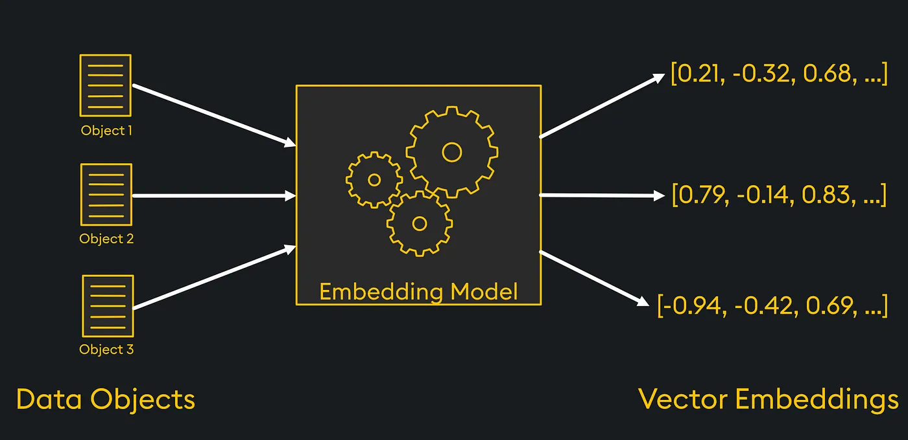
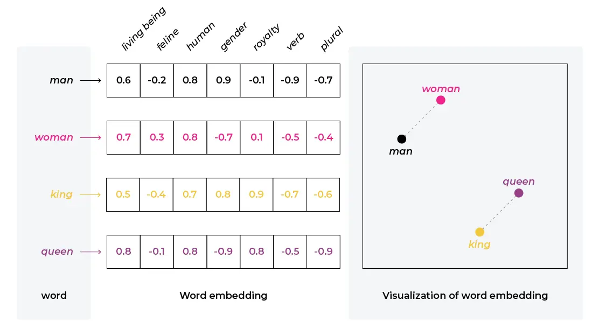
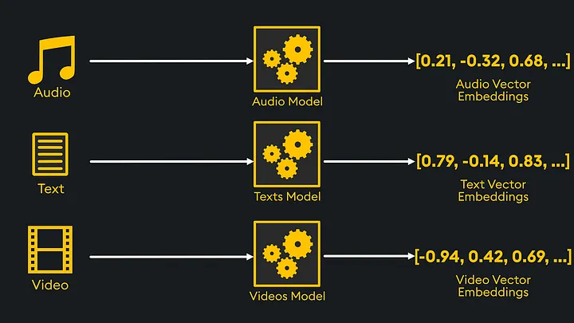
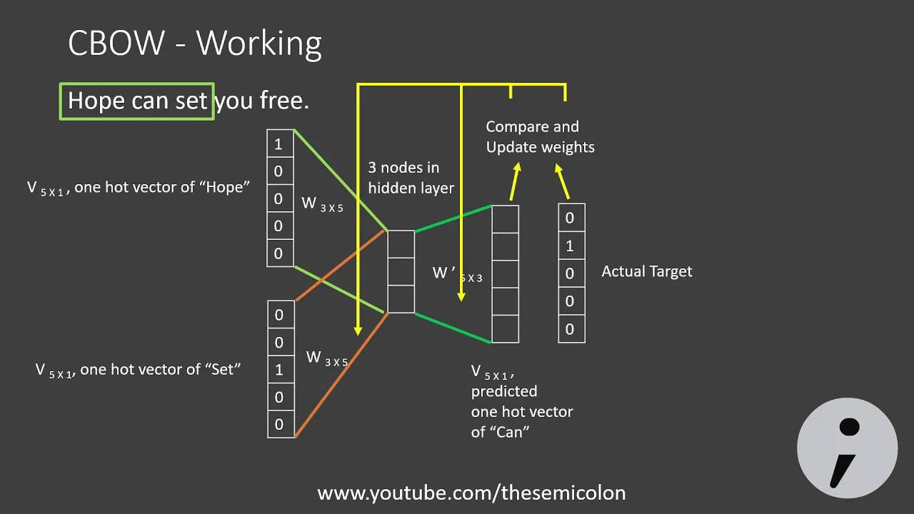
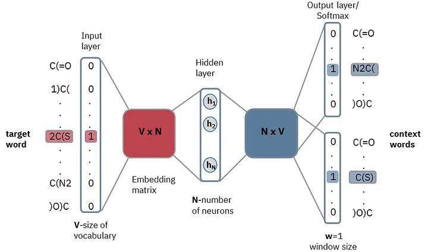
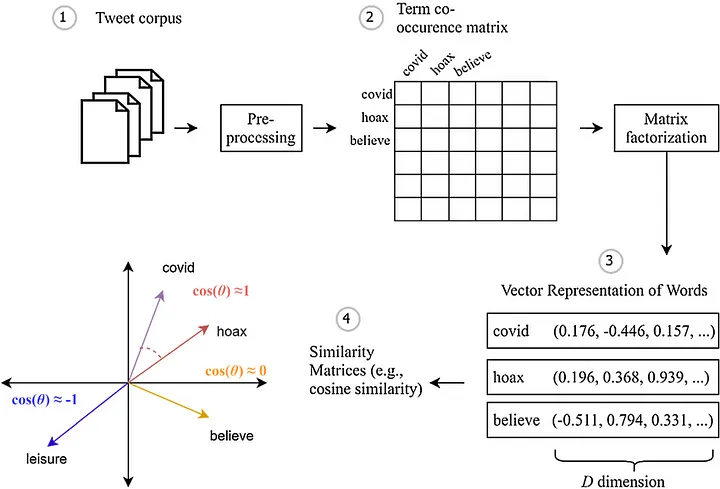
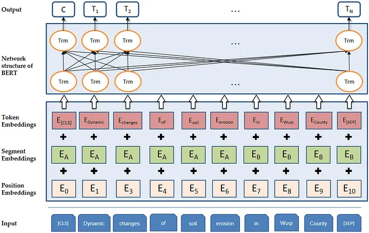

# Embeddings: What Are They and How Do They Work?



[Models](./models.md)

## 📌 What Are Embeddings?

Embeddings are dense, low-dimensional representations of high-dimensional data. They transform complex information into a form that is understandable for machine learning algorithms.

- Facilitate semantic analysis in NLP (Natural Language Processing).
- Used in recommendation systems, image, and audio analysis.

With embeddings, algorithms can better understand context and relationships between data.



---

## 🗂️ Example of Application

Consider the words: **"queen," "king," "princess," "prince"**.

### One-hot Encoding:

```plaintext
| Word       | One-hot Vector  |
| ---------- | --------------- |
| queen      | [1, 0, 0, 0]    |
| king       | [0, 1, 0, 0]    |
| princess   | [0, 0, 1, 0]    |
| prince     | [0, 0, 0, 1]    |
```

This representation does not show relationships between words.

### Embedding Representation:

```plaintext
| Word       | [Gender, Age]  |
| ---------- | -------------- |
| queen      | [1, 0]         |
| king       | [0, 0]         |
| princess   | [1, 1]         |
| prince     | [0, 1]         |
```

- **Gender:** 1 = female, 0 = male
- **Age:** 1 = youth, 0 = adulthood

This makes similarities and differences easy to identify.

---

## 🚀 Applications of Embeddings

- **Recommendation Systems:** Predicting user preferences.
- **Natural Language Processing (NLP):** Semantic text analysis.
- **Image and Audio Analysis:** Classification and pattern recognition.

Embeddings are the foundation of AI models like transformers.

## 🌓 Types of Embeddings

1. **Word Embeddings**  
   Represent individual words as vectors. Examples include Word2Vec, GloVe, and FastText. They are essential for NLP tasks, enabling models to understand semantic relationships between words.

   **Example:** In Word2Vec, the word "king" might be represented as `[0.5, 0.8, -0.1, 0.3, 0.9]`. "Queen" would have a similar vector, showing their semantic similarity, while "apple" would be far apart in vector space.

2. **Sentence Embeddings**  
   Capture the meaning of entire sentences or paragraphs. Models like Universal Sentence Encoder and Sentence-BERT (SBERT) generate these embeddings by averaging or aggregating word embeddings.

   **Example:** For "The cat sat on the mat," sentence embeddings assign a vector reflecting the overall meaning, not just individual words.

3. **Image Embeddings**  
   Used in computer vision to represent images as vectors. Convolutional Neural Networks (CNNs) often generate these embeddings for tasks like image search and classification.

   **Example:** An image of a cat would map to a vector close to other cat images in embedding space, aiding in recognizing similar objects.

4. **Graph Embeddings**  
   Map nodes or subgraphs to vectors, preserving structural relationships within the graph. Models like DeepWalk and GraphSAGE generate these embeddings.

   **Example:** In a social network graph, embeddings can represent users as vectors where closeness indicates the strength of their relationships.



## Key Embedding Models

### Word2Vec
Word2Vec, developed by Google, was one of the pioneering word embedding models. It uses shallow neural networks to learn word associations from large text corpora. Word2Vec has two main approaches: Continuous Bag of Words (CBOW) and Skip-Gram.

- **CBOW:** Predicts a target word based on surrounding context words. E.g., in "The cat sat on the mat," the model might predict "sat" from "cat," "on," and "mat."
  

- **Skip-Gram:** Works in reverse, predicting context words from a target word. Given "sat," the model would predict "cat," "on," and "mat."
  

**Skip-Gram Architecture:**  
Word2Vec generates embeddings where semantically similar words have similar vector representations.

**Example:** The analogy "king" − "man" + "woman" ≈ "queen" shows how Word2Vec captures semantic meanings and relationships between words.

---

### GloVe (Global Vectors for Word Representation)
GloVe, developed by Stanford University, is another popular word embedding model. Unlike prediction-based Word2Vec, GloVe is a count-based model using a co-occurrence matrix of words across the corpus. It aims to create word vectors capturing global statistical co-occurrence information.

- **Advantage:** Excels at capturing both local and global context, making it suitable for various NLP tasks.

- **Example:** If "ice" and "snow" frequently co-occur, GloVe will create vectors placing them close in vector space, reflecting their semantic relationship.
  

---

### BERT (Bidirectional Encoder Representations from Transformers)
BERT represents a major advancement in embedding models. Unlike traditional models treating words independently, BERT generates contextualized embeddings, meaning the same word can have different vectors depending on context. BERT uses the Transformer architecture with attention mechanisms to model relationships between words.

- **Key Feature:** BERT is bidirectional, considering both left and right context during training, capturing the full meaning of words within sentences.

- **Architecture:** Uses multiple Transformer layers applying self-attention to capture relationships regardless of distance in a sentence.

- **Training:** Trained with Masked Language Modeling (MLM) and Next Sentence Prediction (NSP). In MLM, some words are masked, and the model predicts missing words. In NSP, it predicts if two sentences are sequentially related.

- **Application:** Excels in tasks like question answering and text classification. For instance, in customer support, BERT helps understand and accurately respond to queries.

- **Example:** In "The bank can guarantee the deposit will arrive tomorrow," BERT generates different embeddings for "bank" based on whether it refers to a financial institution or a riverbank.


---

### GPT (Generative Pre-trained Transformer)
GPT, developed by OpenAI, is another Transformer-based model focused on generative tasks. Unlike BERT, which is primarily for text understanding, GPT excels at generating coherent text from prompts. GPT uses a unidirectional Transformer, considering only left-side context when generating text.

- **Key Feature:** Pre-trained on large text datasets and fine-tuned for specific tasks, making it versatile. Its human-like text generation is popular in chatbots, content creation, and creative writing.

- **Architecture:** Uses stacked Transformer decoder layers with self-attention, predicting the next token in a sequence.

- **Training:** Pre-trained with unsupervised learning to predict the next word in a sequence, then fine-tuned for specific tasks using supervised learning.

- **Application:** Used in generating articles, poems, and even code. For example, GPT-3 can write a full essay from a short prompt, with text often indistinguishable from human writing.

- **Example:** Given "Once upon a time," GPT can generate an entire story, using its understanding of language and context to create coherent and creative narratives.

