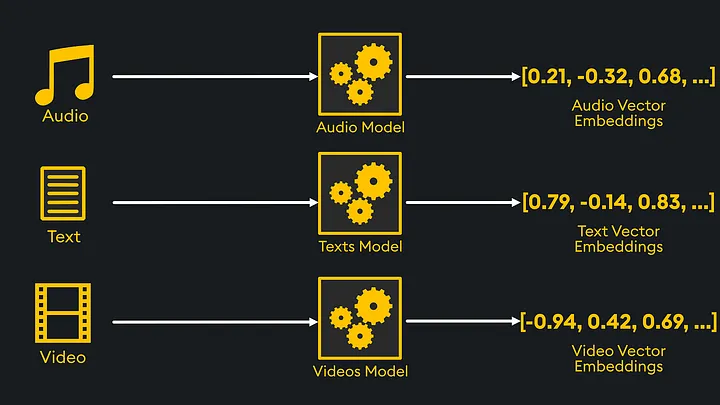
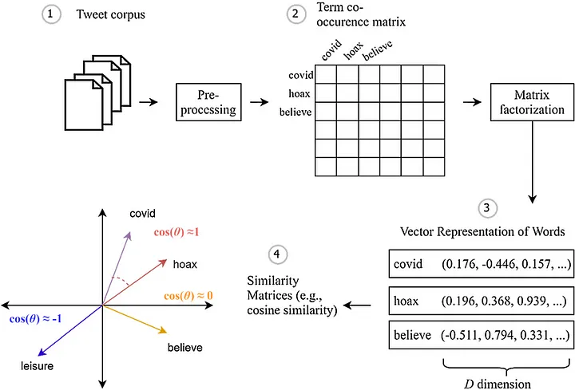

# Embeddings: Co to jest i jak działa?


## 📌 Czym są Embeddings?

Embeddings to gęste, niskowymiarowe reprezentacje danych wysokowymiarowych. Pozwalają na przekształcenie złożonych informacji w formę zrozumiałą dla algorytmów uczenia maszynowego.

- Ułatwiają analizę semantyczną w NLP (przetwarzanie języka naturalnego).
- Wykorzystywane w systemach rekomendacji, analizie obrazów i dźwięków.

Dzięki embeddingom algorytmy mogą lepiej rozumieć kontekst i relacje między danymi.


---

## 🗂️ Przykład Zastosowania

Rozważmy słowa: **"królowa", "król", "księżniczka", "książę"**.

### Kodowanie One-hot:

```plaintext
| Word       | One-hot Vector  |
| ---------- | --------------- |
| queen      | [1, 0, 0, 0]    |
| king       | [0, 1, 0, 0]    |
| princess   | [0, 0, 1, 0]    |
| prince     | [0, 0, 0, 1]    |
```

Takie przedstawienie nie pokazuje relacji między słowami.

### Reprezentacja Embedding:

```plaintext
| Word       | [Gender, Age]  |
| ---------- | -------------- |
| queen      | [1, 0]         |
| king       | [0, 0]         |
| princess   | [1, 1]         |
| prince     | [0, 1]         |
```

- **Gender:** 1 = female, 0 = male
- **Age:** 1 = youth, 0 = adulthood

Dzięki temu łatwo dostrzec podobieństwa i różnice.

---

## 🚀 Zastosowania Embeddingów

- **Systemy rekomendacji:** Przewidywanie preferencji użytkowników.
- **Przetwarzanie języka naturalnego (NLP):** Analiza semantyczna tekstu.
- **Analiza obrazów i dźwięku:** Klasyfikacja i rozpoznawanie wzorców.

Embeddings są fundamentem modeli AI, takich jak transformery.

## 🌓 Rodzaje Embeddingów

1. **Embeddingi Słów (Word Embeddings)**  
   Te embeddingi reprezentują pojedyncze słowa jako wektory. Przykłady obejmują Word2Vec, GloVe i FastText. Embeddingi słów są podstawą w zadaniach NLP, umożliwiając modelom zrozumienie semantycznych relacji między słowami.

   **Przykład:** W Word2Vec, słowo takie jak "król" ("king") może być reprezentowane przez wektor taki jak `[0.5, 0.8, -0.1, 0.3, 0.9]`. Słowo "królowa" ("queen") miałoby podobny wektor, co pokazuje ich semantyczne podobieństwo, podczas gdy słowo "jabłko" ("apple") byłoby znacznie bardziej odległe w przestrzeni wektorowej.

2. **Embeddingi Zdań (Sentence Embeddings)**  
   Te embeddingi wychwytują znaczenie całych zdań lub akapitów. Modele takie jak Universal Sentence Encoder i Sentence-BERT (SBERT) generują te embeddingi poprzez uśrednianie lub agregację embeddingów słów w celu stworzenia pojedynczego wektora reprezentującego całe zdanie.

   **Przykład:** W zdaniu "Kot usiadł na macie" ("The cat sat on the mat"), embedding zdań może przypisać temu zdaniu wektor, który odzwierciedla ogólne znaczenie zdania, a nie tylko poszczególne słowa.

3. **Embeddingi Obrazów (Image Embeddings)**  
   Te embeddingi są wykorzystywane w wizji komputerowej do reprezentowania obrazów jako wektorów. Konwolucyjne sieci neuronowe (CNN) często służą jako podstawa do generowania tych embeddingów, które mogą być następnie wykorzystywane w zadaniach takich jak wyszukiwanie obrazów czy klasyfikacja.

   **Przykład:** Obraz kota może zostać odwzorowany w postaci wektora bliskiego innym obrazom kotów w przestrzeni embeddingów, co pomaga modelowi rozpoznawać podobne obiekty na różnych obrazach.

4. **Embeddingi Grafów (Graph Embeddings)**  
   W embeddingach grafów węzły lub całe podgrafy są odwzorowywane na wektory, które zachowują strukturalne relacje w obrębie grafu. Modele takie jak DeepWalk i GraphSAGE są wykorzystywane do generowania tych embeddingów.

   **Przykład:** W grafie sieci społecznościowej embeddingi mogą być używane do reprezentowania użytkowników jako wektorów, gdzie bliskość wektorów wskazuje na siłę relacji między użytkownikami.



## Kluczowe Modele Embeddingów

### Word2Vec
Word2Vec, opracowany przez Google, był jednym z pionierskich modeli embeddingów słów. Wykorzystuje płytkie sieci neuronowe do nauki powiązań między słowami na podstawie dużego korpusu tekstu. Word2Vec ma dwa główne podejścia: Continuous Bag of Words (CBOW) i Skip-Gram.

- **CBOW:** W CBOW model przewiduje docelowe słowo na podstawie otaczających je słów kontekstowych. Na przykład w zdaniu "Kot usiadł na macie" model może przewidzieć słowo "usiadł" na podstawie słów kontekstowych "kot", "na" i "macie".
  

- **Skip-Gram:** Model Skip-Gram działa odwrotnie, przewidując słowa kontekstowe na podstawie słowa docelowego. Na przykład, mając słowo "usiadł", model przewidziałby "kot", "na" i "macie".
  

**Architektura Skip-Gram:**  
Word2Vec uczy się generowania embeddingów, w których semantycznie podobne słowa mają podobne reprezentacje wektorowe.

**Przykład:** Znane porównanie: "król" − "mężczyzna" + "kobieta" ≈ "królowa". Pokazuje to, że Word2Vec wychwytuje zarówno znaczenie semantyczne, jak i relacje między słowami.

---

### GloVe (Global Vectors for Word Representation)
GloVe, opracowany przez Uniwersytet Stanforda, to kolejny popularny model embeddingów słów. W przeciwieństwie do Word2Vec, który opiera się na predykcji, GloVe to model oparty na zliczaniu, wykorzystujący macierz współwystępowania słów w całym korpusie tekstu. Celem GloVe jest tworzenie wektorów słów, które oddają globalne informacje statystyczne o współwystępowaniu słów.

- **Zaleta:** GloVe dobrze radzi sobie z wychwytywaniem zarówno lokalnego, jak i globalnego kontekstu, co czyni go odpowiednim do różnych zadań NLP.

- **Przykład:** Jeśli słowa takie jak "lód" i "śnieg" często współwystępują w korpusie, GloVe utworzy wektory, w których "lód" i "śnieg" będą blisko siebie w przestrzeni wektorowej, odzwierciedlając ich semantyczny związek.
  

---

### BERT (Bidirectional Encoder Representations from Transformers)
BERT to znaczący krok naprzód w modelach embeddingów. W przeciwieństwie do tradycyjnych modeli traktujących słowa niezależnie, BERT generuje kontekstualizowane embeddingi, co oznacza, że to samo słowo może mieć różne wektory w zależności od kontekstu. BERT opiera się na architekturze Transformer, wykorzystując mechanizmy uwagi do modelowania relacji między słowami w zdaniu.

- **Kluczowa cecha:** BERT jest dwukierunkowy, co oznacza, że podczas treningu bierze pod uwagę kontekst z lewej i prawej strony słowa. Pozwala to na pełne uchwycenie znaczenia słowa w zdaniu.

- **Architektura:** BERT korzysta z wielu warstw Transformerów do tworzenia embeddingów. Każda warstwa Transformer stosuje mechanizm samo-uwagi, aby wychwycić relacje między słowami, niezależnie od ich odległości w zdaniu.

- **Trening:** BERT jest trenowany z wykorzystaniem dwóch zadań: Masked Language Modeling (MLM) i Next Sentence Prediction (NSP). W MLM niektóre słowa w zdaniu wejściowym są maskowane, a model uczy się przewidywać brakujące słowa. W NSP model uczy się przewidywać, czy dwa zdania są ze sobą powiązane.

- **Zastosowanie:** BERT doskonale sprawdza się w zadaniach takich jak odpowiadanie na pytania i klasyfikacja tekstu. Na przykład w systemie obsługi klienta BERT może być wykorzystywany do zrozumienia i precyzyjnego odpowiadania na zapytania klientów.

- **Przykład:** W zdaniu "Bank może zagwarantować, że depozyt dotrze jutro" BERT wygeneruje różne embeddingi dla słowa "bank" w zależności od kontekstu. Zrozumie, czy "bank" odnosi się do instytucji finansowej, czy do brzegu rzeki.

---

### GPT (Generative Pre-trained Transformer)
GPT, opracowany przez OpenAI, to kolejny model oparty na Transformerach, skupiający się na zadaniach generatywnych. W przeciwieństwie do BERT, który jest przeznaczony głównie do zrozumienia tekstu, GPT doskonale radzi sobie z generowaniem spójnego tekstu na podstawie podanego promptu. GPT wykorzystuje jednokierunkowy Transformer, co oznacza, że podczas generowania tekstu bierze pod uwagę tylko kontekst z lewej strony.

- **Kluczowa cecha:** GPT jest wstępnie trenowany na dużych zbiorach danych tekstowych i dostrajany do konkretnych zadań, co czyni go bardzo wszechstronnym. Jego zdolność do generowania tekstu przypominającego ludzkie wypowiedzi sprawia, że jest popularny w aplikacjach takich jak chatboty, generowanie treści i twórcze pisanie.

- **Architektura:** GPT wykorzystuje stos warstw dekoderów Transformer. Każda warstwa stosuje mechanizm samo-uwagi do sekwencji wejściowej i generuje przewidywanie dla następnego tokena (słowa lub pod-słowa) w sekwencji.

- **Trening:** GPT jest trenowany w trybie uczenia nienadzorowanego, gdzie model uczy się przewidywać kolejne słowo w sekwencji. Następnie przeprowadza się dostrajanie do specyficznych zadań z wykorzystaniem uczenia nadzorowanego.

- **Zastosowanie:** GPT znalazł zastosowanie w różnych kreatywnych aplikacjach, takich jak generowanie artykułów, wierszy, a nawet kodu. Na przykład GPT-3 może wygenerować cały esej na podstawie krótkiego promptu, a jego tekst często jest trudny do odróżnienia od pisma ludzkiego.

- **Przykład:** Mając prompt taki jak "Dawno, dawno temu..." ("Once upon a time"), GPT może wygenerować całą historię, wykorzystując swoje zrozumienie języka i kontekstu do stworzenia spójnej i kreatywnej narracji.
