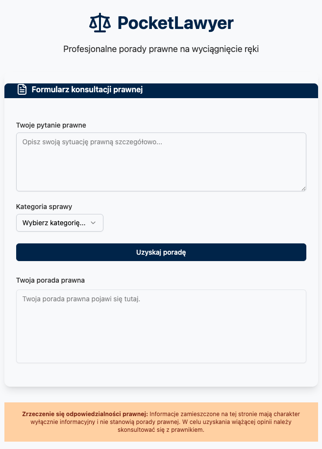

# ⚖️ PocketLawyer – Legal Advice at Your Fingertips

**PocketLawyer** is a modern frontend application that allows users to submit legal questions and receive responses in real time. Designed with simplicity and accessibility in mind, it features a clean UI powered by Tailwind CSS and ShadCN UI components, and communicates with a backend webhook for dynamic response streaming.

---

## ✨ Features

- 📝 Submit legal questions via a simple form
- 📂 Select a legal category from a predefined list
- 📡 Sends data to a webhook (`/webhook-test/pocket-lawyer`)
- 🔄 Receives legal advice
- 🎨 Clean, responsive UI using **Tailwind CSS**
- 🧩 Modular design using **ShadCN UI components**
- ⚠️ Built-in legal disclaimer

---

## 🧰 Technologies

- **React 18+**
- **TypeScript**
- **Tailwind CSS**
- **[shadcn/ui](https://ui.shadcn.com/)** – headless UI components
- **Custom Webhook Backend** – receives and responds to requests (streaming)

---

## 🚀 Getting Started

1. **Install dependencies**

```bash
npm install
```

2. **Run the development server**

```bash
npm run dev
```

3. **Start the backend webhook**

Make sure your backend is running and listening  
Use n8n `PocketLawyer.json`


---

## 🔧 TODO / Future Improvements

- ✅ Enable toast notifications (`sonner`) for success/error
- 📱 Improve mobile responsiveness
- 🔐 Add authentication support
- 🧠 Connect to AI/GPT-based backend
- 🌐 Add multilingual support (e.g. English/Polish)

---


## 🖼️ Screenshot


