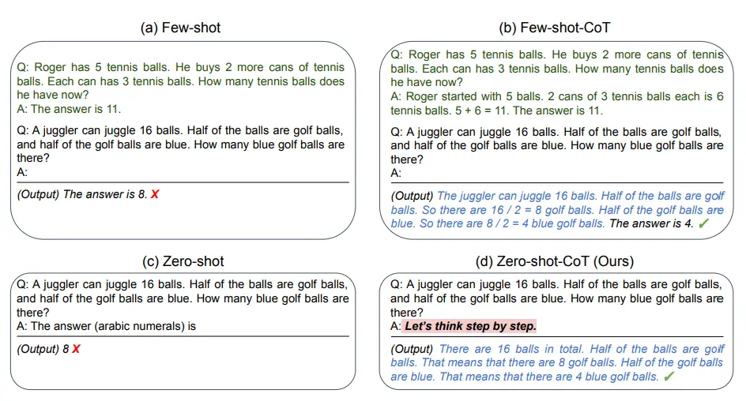

# Zero-shot Chain-of-Thought

> [!TIP]
> Based on [CoT](./chain-of-thought.md)



The essential magic is by adding "Let's think step by step" to the original prompt.

## Example:
*Prompt*:
```
I went to the market and bought 10 apples. I gave 2 apples to the neighbor and 2 to the repairman. I then went and bought 5 more apples and ate 1. How many apples did I remain with?
```
*Output*:
```
11 apples
```
> [!CAUTION]
> The answer is incorrect! Now Let's try with the special prompt.


*Prompt*:
```
I went to the market and bought 10 apples. I gave 2 apples to the neighbor and 2 to the repairman. I then went and bought 5 more apples and ate 1. How many apples did I remain with? 
Let's think step by step.
Let’s work this out in a step-by-step way to be sure we have the right answer.
```
*Output*:
```
First, you started with 10 apples.
You gave away 2 apples to the neighbor and 2 to the repairman, so you had 6 apples left.
Then you bought 5 more apples, so now you had 11 apples.
Finally, you ate 1 apple, so you would remain with 10 apples.
```