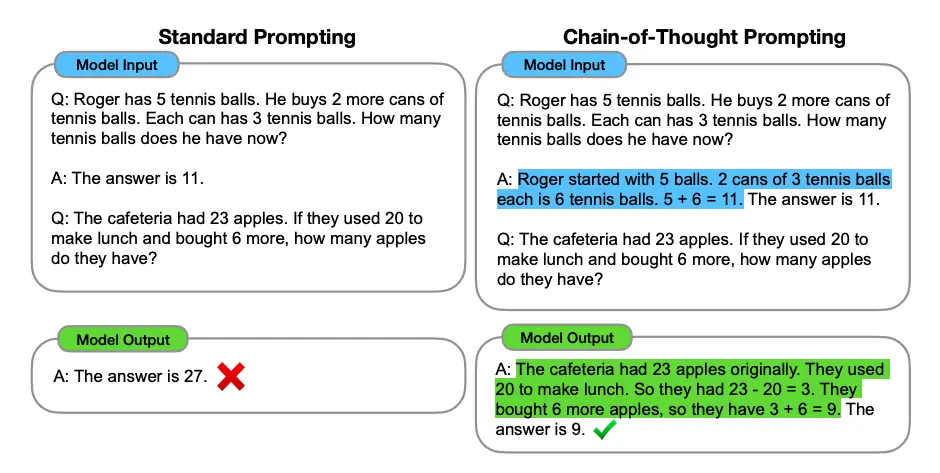

# Chain-of-Thought (CoT) Prompting 

> [!TIP]
> [Zero-Shot Chain of Thought](./chain-of-thought-zero-shot.md)
> 
> [Manual Chain of Thought](./chain-of-thought-manual.md)

Technique where the model is instructed to think through a series of intermediate steps or reasoning before reaching the final answer. Instead of directly jumping to a conclusion, the model generates a chain of reasoning that it follows logically. This approach is particularly useful for tasks involving multi-step logic, arithmetic, or problem-solving, as it helps the model break down complex problems into smaller, manageable steps. By prompting the model to explain or consider each step, CoT makes the decision-making process more transparent and improves accuracy.

> [!IMPORTANT]
> Keep in mind that this is an emergent ability that arises with sufficiently large language models (LLMs).



## Examples:
### Mathematical:
You can combine it with [few-shot prompting](./few-shot.md) to get better results on more complex tasks that require reasoning before responding.
```py
The odd numbers in this group add up to an even number: 4, 8, 9, 15, 12, 2, 1.
Answer: Adding all the odd numbers (9, 15, 1) gives 25. The answer is False.

The odd numbers in this group add up to an even number: 17,  10, 19, 4, 8, 12, 24.
Answer: Adding all the odd numbers (17, 19) gives 36. The answer is True.

The odd numbers in this group add up to an even number: 16,  11, 14, 4, 8, 13, 24.
Answer: Adding all the odd numbers (11, 13) gives 24. The answer is True.

The odd numbers in this group add up to an even number: 17,  9, 10, 12, 13, 4, 2.
Answer: Adding all the odd numbers (17, 9, 13) gives 39. The answer is False.

The odd numbers in this group add up to an even number: 15, 32, 5, 13, 82, 7, 1. 
Answer:
```
*Output*:
```py
Adding all the odd numbers (15, 5, 13, 7, 1) gives 41. The answer is False.
```