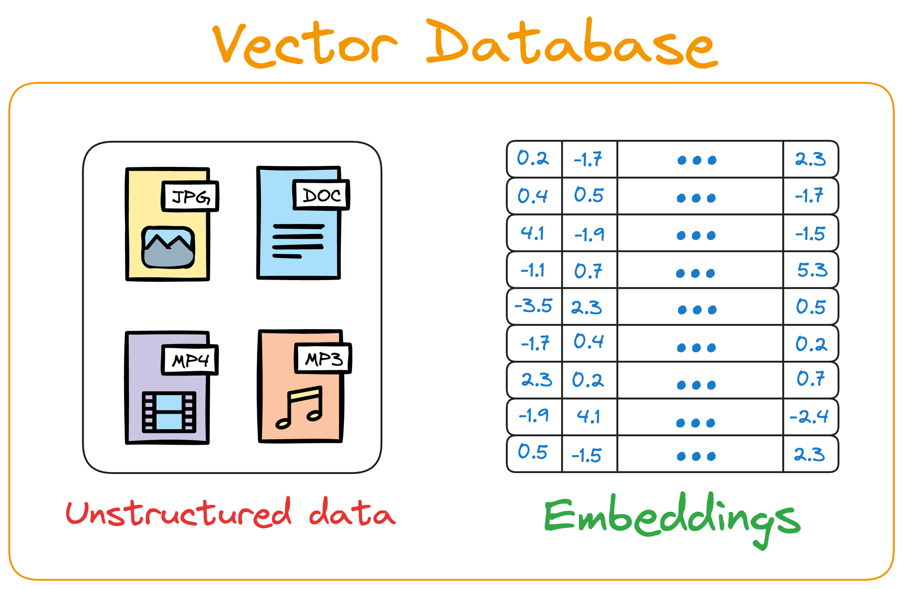

# Vector database
is a specialized type of database that stores information in the form of **vectors**. Vectors are mathematical representations of objects in a multidimensional space, which can encompass hundreds or even thousands of dimensions.

Vectors can represent various features of data, such as `texts`, `images`, `videos`, or `audio`. This makes vector databases extremely effective in applications like natural language processing (NLP), recommendation systems, or semantic search, where understanding context and similarity between data is crucial.

## Examples

[Basics](./src/basic/vector_database_en.ipynb)

[Real word example](./src/example/vectore-database.ipynb)